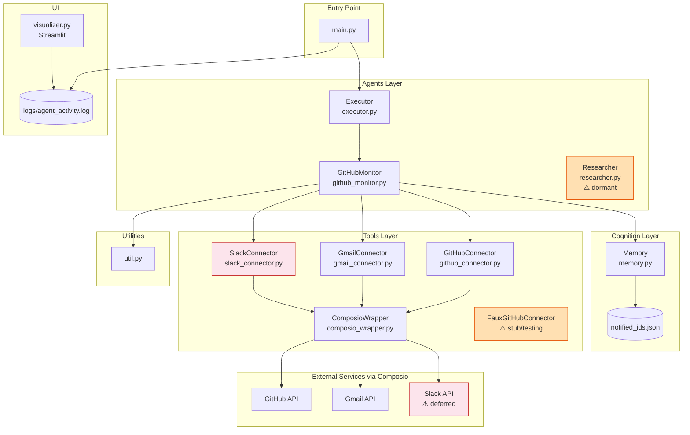
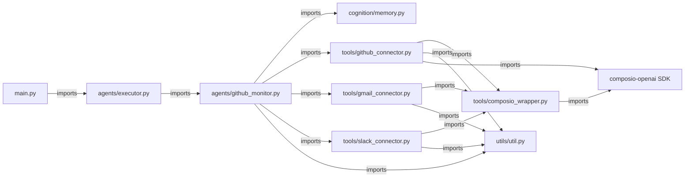
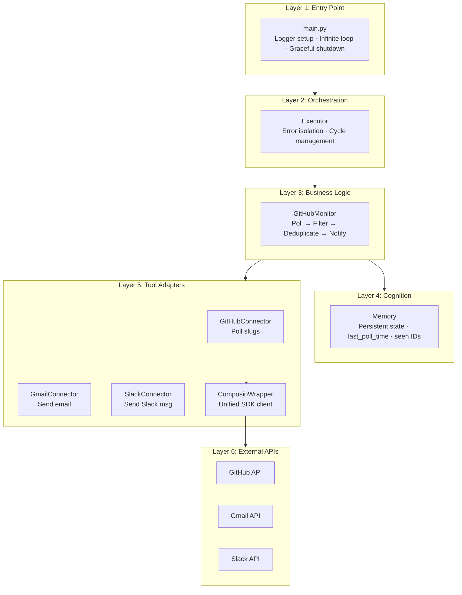
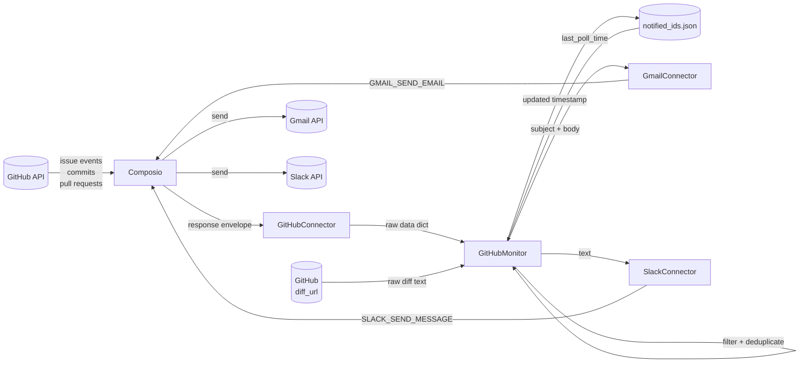
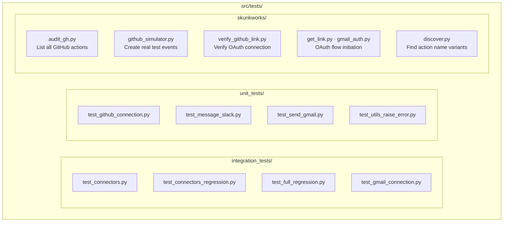
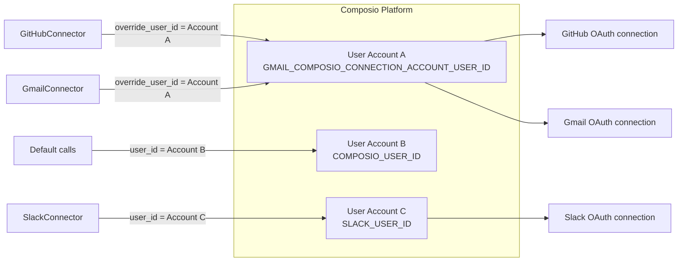

# Component Diagrams

All diagrams use [Mermaid](https://mermaid.js.org/) syntax.

---

## 1. Full Component Dependency Graph

---

## 2. Module Dependency Graph (Import Map)

---

## 3. Layered Architecture

---

## 4. Data Flow Diagram

---

## 5. Testing Structure

---

## 6. Composio Connection Account Map

> **Note:** Account A holds both the GitHub and Gmail connections. The naming (`GMAIL_COMPOSIO_CONNECTION_ACCOUNT_USER_ID`) is historical — it was named after the first connection established on that account.
