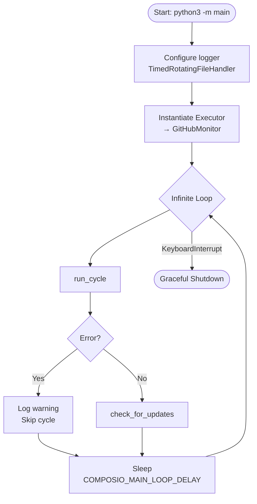
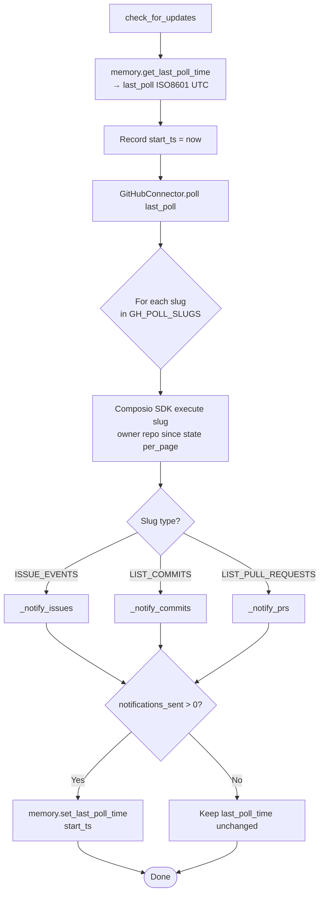
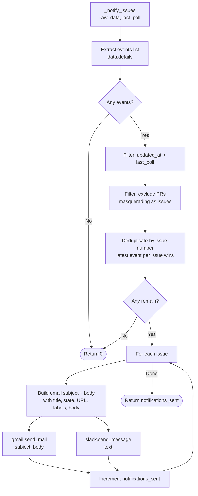
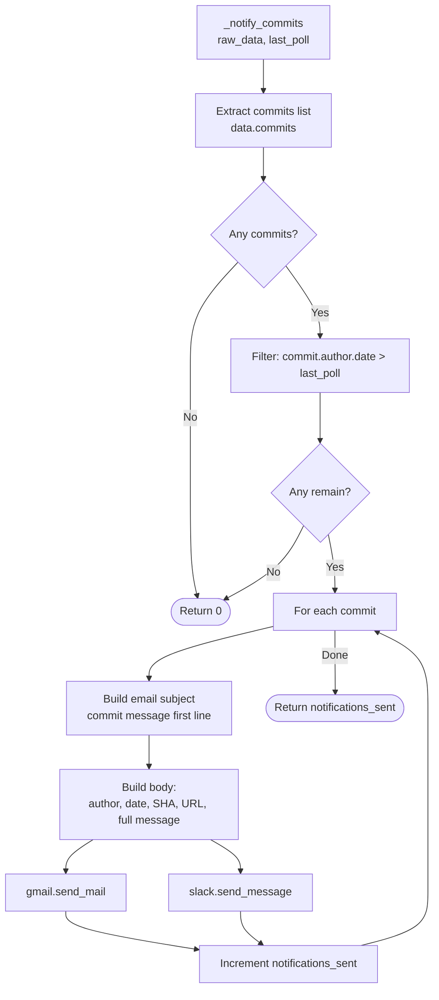
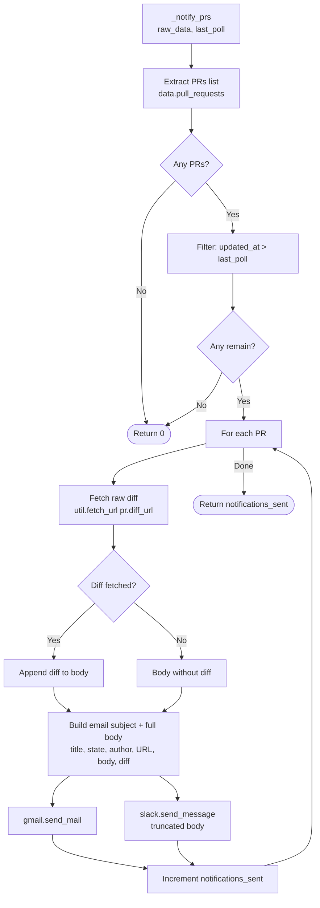
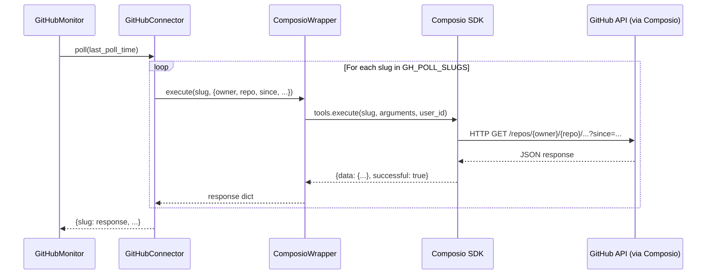
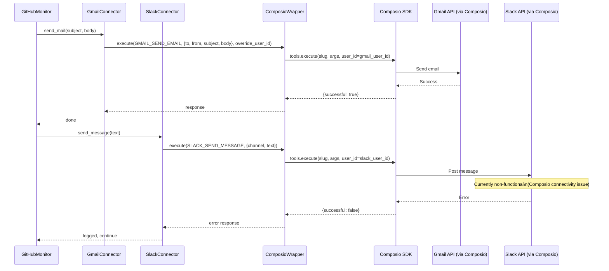
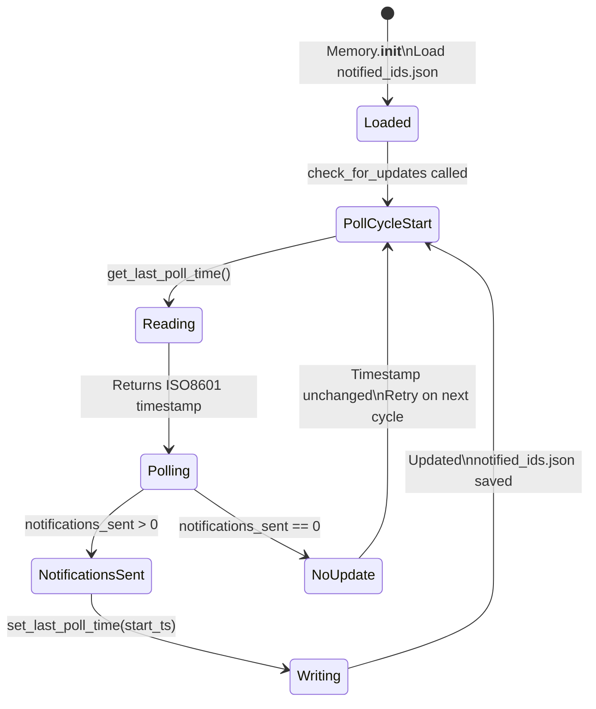
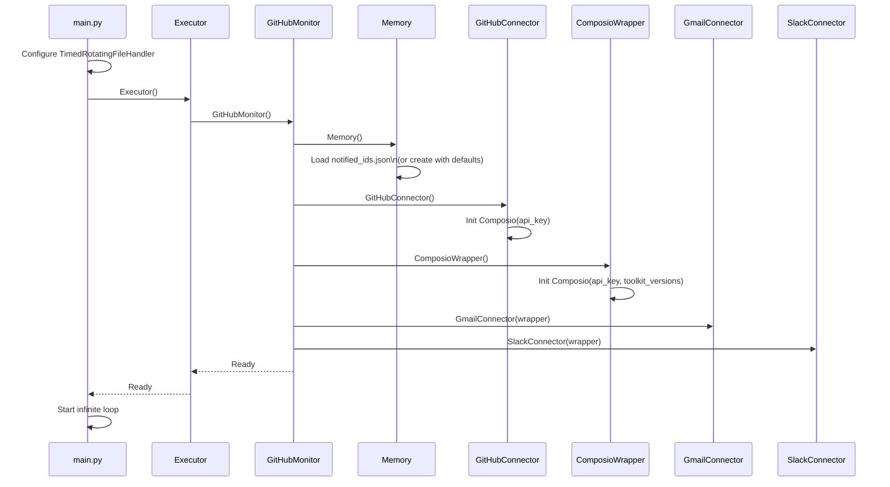

# Workflow Diagrams

All diagrams use [Mermaid](https://mermaid.js.org/) syntax. Render in GitHub, VS Code (Markdown Preview Mermaid Support), or [mermaid.live](https://mermaid.live).

---

## 1. Main Polling Loop

---

## 2. check_for_updates — Full Pipeline

---

## 3. Issue Notification Flow

---

## 4. Commit Notification Flow

---

## 5. Pull Request Notification Flow

---

## 6. Composio SDK Execution Sequence

---

## 7. Notification Delivery Sequence

---

## 8. Memory / State Management

---

## 9. System Startup Sequence

